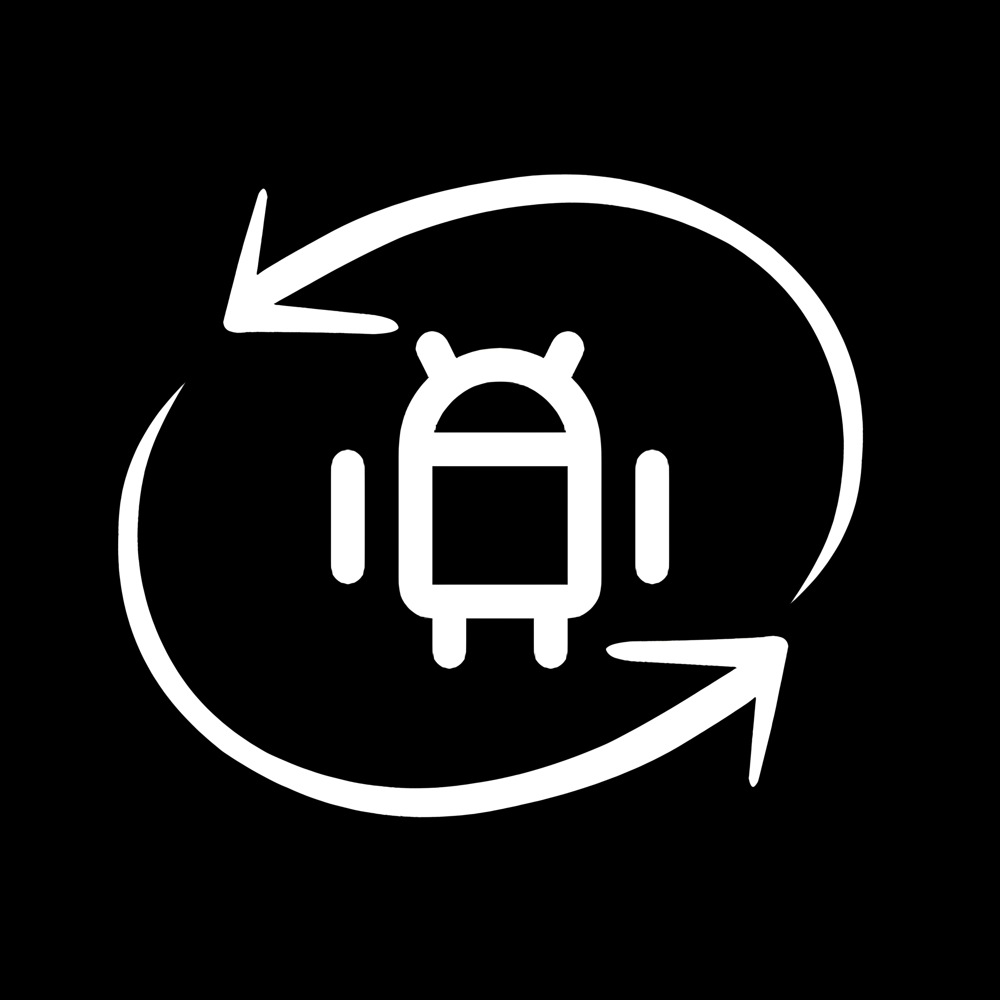

  

<h1 align="center">⚡ QuickSE</h1>

  <i>Instantly check & toggle SELinux status on rooted Android devices.</i> 
  <code>Jetpack Compose</code> · <code>Kotlin</code> · <code>Material You</code>

  
  
  

---

## What is QuickSE?

**QuickSE** is a lightweight, open-source Android app that allows rooted users to **view**, **toggle**, and **automatically set** SELinux mode between **Enforcing** and **Permissive**, all in a modern Material You interface.  

Built with **Jetpack Compose** and **Kotlin**, it offers a fast, clean, and intuitive experience with just the essential tools you need.

---

## Requirements

- Android 7.1+ (API 25 or higher)
- Root access (required to change SELinux mode)

---

> SELinux mode resets on reboot unless you enable auto-toggle.

---

## Download

- [**Download Latest APK**](https://github.com/maazm7d/QuickSE/releases)

---

## License

This project is licensed under the [GNU GPLv3](LICENSE).  
You are free to use, modify, and distribute it under the terms of the license.

---

## Contact / Support

Questions or suggestions?  
Reach out on Telegram: [@maazm7d](https://t.me/maazm7d)

